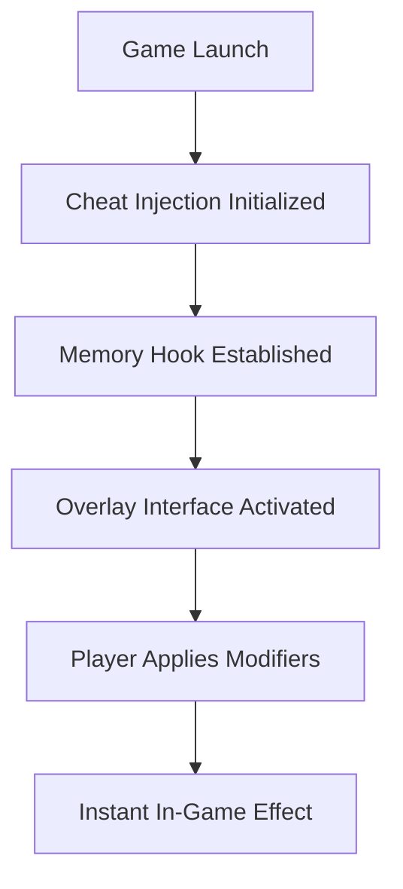

# 💾 Digimon Story Time Stranger Cheat – Dominate the Digital Realm

The **Digimon Story Time Stranger Cheat** is a high-performance game enhancer built for players who want to experience the full depth of the digital world without grinding. Designed with balance, flexibility, and fun in mind, this tool lets you unlock resources, evolve your Digimon instantly, and customize your entire roster’s behavior in real time.

Whether you’re exploring the campaign or refining team synergy, this cheat gives you full control of training, battles, and world progression — all from a lightweight, user-friendly interface.

---

## 🧩 Overview

The **Digimon Story Time Stranger Cheat** gives players the freedom to bend digital reality to their will. With adjustable evolution levels, battle AI modifiers, and currency control, it ensures your journey is smooth, powerful, and endlessly customizable.

Key systems include:

* Infinite HP, SP, and DigiEnergy.
* Instant evolution & de-evolution triggers.
* Max friendship, bond, and DNA compatibility.
* Unlimited bits and materials for upgrades.
* AI control override for training or cinematic fights.

Perfect for single-player progression, strategic experimentation, or showcasing cinematic battles without limits.

---

## ⚙️ Key Features

### 🧬 Evolution & Stats Control

* Unlock any Digivolution instantly.
* Freeze Digimon age to prevent regression.
* Modify stats (ATK, DEF, SPD, INT, HP, SP) in real time.
* Enable “DNA Evolution Bypass” for hybrid forms without requirements.

```ini
[DigimonConfig]
InfiniteHP=True
InstantEvolve=True
FriendshipLevel=Max
DigiEnergy=Unlimited
AutoHeal=True
```

### ⚔️ Battle Optimization

* Auto-critical hits and chain combos.
* Enemy stat scaling toggle for fair or easy fights.
* Disable cooldowns for ultimate skill spam.
* Optional “Trainer Assist” for synchronized combo timing.

### 💰 Resource Enhancements

* Infinite Bits (currency).
* 1-click upgrade crafting and equipment enhancements.
* Unlock hidden evolution stones and relic items.

> [!NOTE]
> All features are **offline-only**, ensuring safe single-player use with no risk to online accounts or progression data.

---

## 💻 Compatibility

| Platform           | Supported | Details                       |
| ------------------ | --------- | ----------------------------- |
| Windows 11         | ✅         | Fully supported               |
| Windows 10         | ✅         | Stable and optimized          |
| Steam Version      | ✅         | Auto-detection enabled        |
| Epic Games Version | ⚙️        | Manual target select required |
| Console            | ❌         | Not supported                 |

> [!IMPORTANT]
> Requires **.NET 6.0 Runtime** and **DirectX 12** for proper memory handling and overlay rendering.

---

## ⚡ Setup & Installation

1. **Download** the Digimon Story Time Stranger Cheat package.
2. **Extract** the files into your main game directory.
3. Launch the game first, then run `DSTS_Cheat.exe` as Administrator.
4. Press `F1` to activate and open the cheat control panel.
5. Toggle desired options or load a preset config.

Example startup argument:

```bash
DSTS_Cheat.exe --profile max_evolve --instantload
```

> [!WARNING]
> Disable antivirus “real-time scanning” temporarily if the cheat fails to inject — false positives may block trainer memory hooks.

---

## 🧭 System Workflow



This structure ensures instant synchronization between user toggles and the Digimon runtime engine, with stable frame performance throughout.

---

## ❓ FAQ

**Q: Can this be used online?**
A: No. It’s designed exclusively for offline or local gameplay to prevent desync or bans.

**Q: Does it affect save data?**
A: No permanent changes occur unless you choose to overwrite stats manually.

**Q: Can I customize Digimon forms beyond the limit?**
A: Yes — the Evolution Override module removes level and DNA restrictions.

**Q: Does it support multiple languages?**
A: Yes. English, Japanese, and French UI localizations are included.

**Q: How often is it updated?**
A: Updates follow each game patch to ensure stable functionality and compatibility.

---

## 🏆 Why Players Love It

* No grind — evolve instantly.
* Fully modular and safe for offline play.
* Perfect for collectors, testers, and story mode enthusiasts.
* Compatible with fan translations and custom mods.

---

## 🧠 Final Thoughts

The **Digimon Story Time Stranger Cheat** opens up the game’s full potential, giving you instant access to evolution trees, resource boosts, and performance tweaks that make every fight legendary.

Forge your perfect team, bend the rules of evolution, and experience the digital world the way you want — fast, free, and flawless.

---

**Digimon Story Time Stranger Cheat** – evolve beyond limits, conquer every challenge.
